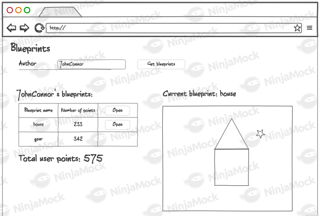

## Escuela Colombiana de Ingeniería
- Jeimy Yaya

# Laboratorio Blueprints.

## 1. Introducción

En este laboratorio integramos un front-end HTML5/JS con un API REST ya construido (BlueprintsRESTAPI). El objetivo principal fue crear un cliente “grueso” que:
- Consulte planos por autor.
- Liste los planos en una tabla (nombre, número de puntos).
- Calcule el total de puntos (usando reduce).
- Permita abrir y dibujar un plano en un <canvas> (conexión de puntos en orden).

El backend (implementado en laboratorio anterior) usa Spring Boot, Spring MVC e inyección de dependencias. Los diagramas del diseño se muestran abajo.

**Diagrama de componentes:** 


**Diagrama de clases:**


## 2. Estado del API REST (contexto)

El API REST ya implementado soporta al menos estos endpoints:
- `GET /blueprints/{author}` → devuelve lista de planos del autor.
- `GET /blueprints/{author}/{name}` → devuelve los puntos del plano específico.

Este README documenta la parte front-end y la integración con dicho API

## 3. Requerimientos previos
- Java 8+/11+
- Maven
- Spring Boot
- Navegador
## 4. Ajustes Backend
Se añadieron las dependencias webjars en pom.xml para servir jQuery y Bootstrap localmente:
```xml
<dependency>
    <groupId>org.webjars</groupId>
    <artifactId>webjars-locator</artifactId>
</dependency>

<dependency>
    <groupId>org.webjars</groupId>
    <artifactId>bootstrap</artifactId>
    <version>3.3.7</version>
</dependency>

<dependency>
    <groupId>org.webjars</groupId>
    <artifactId>jquery</artifactId>
    <version>3.1.0</version>
</dependency>
```
## 5. Front-End - Vistas
1. Se creó el directorio de contenido estático:
```
    src/main/resources/static
```
2. Creación del `index.html`

El archivo contiene los siguientes elementos básicos:
- Título
- Campo de captura del autor
- Botón Get blueprints
- Tabla HTML con encabezados
- Campo para el total de puntos
```html
<body>
    <div class="container">
        <h1 class="text-primary">Blueprints</h1>

        <div class="form-inline">
            <div class="form-group">
                <label for="authorInput">Autor:</label>
                <input id="authorInput" class="form-control" placeholder="Ingrese autor (ej: John)" />
            </div>
            <button id="getBlueprintsBtn" class="btn btn-success">Get blueprints</button>
        </div>

        <hr/>

        <div id="authorInfo">
            Autor seleccionado: <strong id="selectedAuthor"></strong>
        </div>

        <table id="blueprintsTable" class="table table-striped table-bordered" style="margin-top:10px;">
            <thead>
                <tr>
                    <th>Nombre plano</th>
                    <th># Puntos</th>
                </tr>
            </thead>
            <tbody>
            </tbody>
        </table>
        <div>
            Total de puntos: <strong id="totalPoints">0</strong>
        </div>
    </div>
</body>

```
3. Referencias a librerías

Se agregaron las referencias en `<head>`:

```html
    <script src="/webjars/jquery/3.6.0/jquery.min.js"></script>
    <script src="/webjars/bootstrap/3.3.7/js/bootstrap.min.js"></script>
    <link rel="stylesheet"
      href="/webjars/bootstrap/3.3.7/css/bootstrap.min.css" />
```  

4. Subida de la aplicación   
Se ejecuta el proyecto con:
```
mvn spring-boot:run
```
Verificamos el acceso desde: http://localhost:8080/index.html

   
   


Finalmente validamos que no haya errores en la consola del navegador:   


## 6. Front-End - Lógica

1. Se crea un Módulo JavaScript que, a manera de controlador, mantenga los estados y ofrezca las operaciones requeridas por la vista. El módulo se encuentra en la ruta static/js/app.js .


2. Copiamos el módulo provisto (apimock.js) en la misma ruta del módulo antes creado. Se agregaron más planos (con más puntos) a los autores 'quemados' en el código.
```
var mockdata=[];

	mockdata["johnconnor"]=	[
        {author:"johnconnor","points":[{"x":150,"y":120},{"x":215,"y":115}],"name":"house"},
	    {author:"johnconnor","points":[{"x":340,"y":240},{"x":15,"y":215}],"name":"gear"}
    ];
	mockdata["maryweyland"]=[
        {author:"maryweyland","points":[{"x":140,"y":140},{"x":115,"y":115}],"name":"house2"},
	    {author:"maryweyland","points":[{"x":140,"y":140},{"x":115,"y":115}],"name":"gear2"}
    ];
    mockdata["Ana"] = [
        {author: "Ana", name: "car", points: [{x:15,y:15},{x:25,y:25},{x:35,y:35}]},
        {author: "Ana", name: "plane", points: [{x:5,y:5},{x:10,y:10},{x:15,y:15},{x:20,y:20}]}
    ];
    mockdata["Jeimy"] = [
        {author: "Jeimy", name: "house", points: [{x:10,y:10},{x:20,y:20}]},
        {author: "Jeimy", name: "building", points: [{x:10,y:10},{x:30,y:30},{x:40,y:40}]}
    ];
```

3. Se agrega la importación de los dos nuevos módulos a la página HTML (después de las importaciones de las librerías de jQuery y Bootstrap):

    ```html
    <script src="js/apimock.js"></script>
    <script src="js/app.js"></script>
    ```

4. En este paso se implementó un módulo en app.js siguiendo el patrón Módulo de JavaScript. Dentro de él se mantienen de forma privada dos elementos:
- El nombre del autor seleccionado.
- El listado de planos de dicho autor, transformados en objetos con el nombre y el número de puntos.

El módulo expone dos operaciones públicas:

a. `setAuthor`: permite cambiar el autor actual y mostrarlo en la vista.

b. `updateBlueprints`: recibe un autor, consulta sus planos en apimock, los transforma con map para obtener solo nombre y cantidad de puntos, los inserta dinámicamente en la tabla con jQuery, y finalmente calcula el total de puntos usando reduce para actualizarlo en el DOM.

```javascript
var app = (function () {
    var author = "";
    var blueprints = [];

    var setAuthor = function (newAuthor) {
        author = newAuthor;
        $("#selectedAuthor").text(author);
    };

    var updateBlueprints = function (authname) {
        apimock.getBlueprintsByAuthor(authname, function (data) {
            blueprints = data.map(function (bp) {
                return {name: bp.name, points: bp.points.length};
            });

            $("#blueprintsTable tbody").empty();

            blueprints.map(function (bp) {
                $("#blueprintsTable tbody").append(
                    `<tr><td>${bp.name}</td><td>${bp.points}</td></tr>`
                );
            });

            var totalPoints = blueprints.reduce(function (sum, bp) {
                return sum + bp.points;
            }, 0);

            $("#totalPoints").text(totalPoints);
        });
    };

    return {
        setAuthor: setAuthor,
        updateBlueprints: updateBlueprints
    };
})();

```

5. Asociamos la operación antes creada al evento 'on-click' del botón de consulta de la página.
```html
<script>
        $(document).ready(function () {
            $("#getBlueprintsBtn").click(function () {
                var author = $("#authorInput").val();
                app.setAuthor(author);
                app.updateBlueprints(author);
            });
        });
    </script>
```
6. Verificamos el funcionamiento de la aplicación. Para esto rectificamos que al ingresar un usuario existente, se cargue el listado del mismo.
   
#### *Jeimy*
  

#### *Ana*
   

#### *johnconnor*
   

#### *maryweyland*
   


## Para la próxima semana


1. A la página, agregue un [elemento de tipo Canvas](https://www.w3schools.com/html/html5_canvas.asp), con su respectivo identificador. Haga que sus dimensiones no sean demasiado grandes para dejar espacio para los otros componentes, pero lo suficiente para poder 'dibujar' los planos.
```html
    <div id="canvas-container" class="row">
      <div class="col-md-8">
        <canvas id="blueprintCanvas" width="800" height="300"></canvas>
      </div>
      <div class="col-md-4">
        <h4>Plano actual</h4>
        <div id="currentBlueprintName">—</div>
      </div>
    </div>
```
2. Al módulo app.js agregue una operación que, dado el nombre de un autor, y el nombre de uno de sus planos dados como parámetros, haciendo uso del método getBlueprintsByNameAndAuthor de apimock.js y de una función _callback_:
    * Consulte los puntos del plano correspondiente, y con los mismos dibuje consectivamente segmentos de recta, haciendo uso [de los elementos HTML5 (Canvas, 2DContext, etc) disponibles](https://www.w3schools.com/html/tryit.asp?filename=tryhtml5_canvas_tut_path)* Actualice con jQuery el campo <div> donde se muestra el nombre del plano que se está dibujando (si dicho campo no existe, agruéguelo al DOM).
```javascript
    var drawBlueprint = function (author, blueprintName) {
        apimock.getBlueprintsByNameAndAuthor(author, blueprintName, function (blueprint) {

            $("#currentBlueprintName").text(blueprint.name);

            var canvas = document.getElementById("blueprintCanvas");
            var ctx = canvas.getContext("2d");

            ctx.clearRect(0, 0, canvas.width, canvas.height);

            if (blueprint.points.length > 0) {
                ctx.beginPath();
                ctx.moveTo(blueprint.points[0].x, blueprint.points[0].y);
                for (let i = 1; i < blueprint.points.length; i++) {
                    ctx.lineTo(blueprint.points[i].x, blueprint.points[i].y);
                }
                ctx.stroke();
            }
        });
    };
```

3. Además de mostrar el listado de los planos de un autor, permita seleccionar uno de éstos y graficarlo. Para esto, haga que en las filas generadas para el punto 5 incluyan en la última columna un botón con su evento de clic asociado a la operación hecha anteriormente (enviándo como parámetro los nombres correspondientes).
```
blueprints.map(function (bp) {
                $("#blueprintsTable tbody").append(
                    `<tr>
                        <td>${bp.name}</td>
                        <td>${bp.points}</td>
                        <td><button class="btn btn-info" onclick="app.drawBlueprint('${authname}', '${bp.name}')">Open</button></td>
                    </tr>`
                );
            });
```

5. Verifique que la aplicación ahora permita: consultar los planos de un autor y graficar aquel que se seleccione.


6. Una vez funcione la aplicación (sólo front-end), haga un módulo (llámelo 'apiclient') que tenga las mismas operaciones del 'apimock', pero que para las mismas use datos reales consultados del API REST. 
```javascript
var apiclient = (function () {

    return {
        getBlueprintsByAuthor: function(author, callback) {
            $.get("/blueprints/" + author, function(data) {
                callback(data);
            });
        },

        getBlueprintsByNameAndAuthor: function(author, name, callback) {
            $.get("/blueprints/" + author + "/" + name, function(data) {
                callback(data);
            });
        }
    };

})();
```
7. Modifique el código de app.js de manera que sea posible cambiar entre el 'apimock' y el 'apiclient' con sólo una línea de código.
```javascript
// cambiar entre mock y client
var api = apimock; 
// var api = apiclient;
```
8. Agregue los elementos necesarios a la página para que sea más vistosa, y más cercana al mock dado al inicio del enunciado.


## Conclusión

Con este laboratorio se logró integrar exitosamente el cliente HTML5/JS con el API REST existente, permitiendo la consulta, visualización y graficación de planos.  

La aplicación cumple los requerimientos propuestos: listar planos por autor, calcular puntos totales, y representar los planos gráficamente en un canvas. Además, se dejó preparado el código para alternar fácilmente entre datos simulados (`apimock`) y datos reales consumidos desde el API (`apiclient`).  

